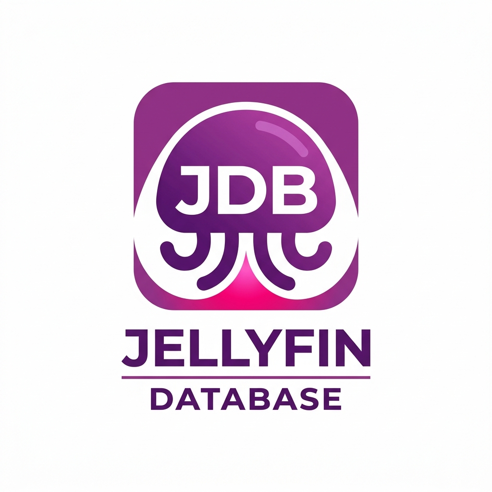

# JDB — MetaHub

**Jellyfin Meta DB** — a self-hosted media metadata aggregator (.NET / C#).

[](https://github.com/Kuschel-code/JDB/actions/workflows/ci.yml)
[](https://github.com/Kuschel-code/JDB/releases/latest)
[](https://dotnet.microsoft.com/)
[](https://jellyfin.org/)

MetaHub builds a single canonical, unified view per media item by combining several
official providers, cross-linking them by ID and caching everything locally — so
Jellyfin (and other clients) get consistent, rich metadata and artwork without hammering
every external API on each scan.

Like [Shoko](https://shokoanime.com/), MetaHub **identifies local files exactly**
(file hash / acoustic fingerprint / identifier) instead of guessing from filenames, and
only then aggregates metadata.

> Scope: **metadata only**. MetaHub does not index or provide unlicensed
> streaming/download sources. It identifies files you already own and enriches them.

**Media types:** Music · Movies · Series · Anime · Books

## Two ways to run

| Mode | What runs | Database | Best for |
|------|-----------|----------|----------|
| **Embedded plugin** (default) | Everything inside Jellyfin | local **SQLite** | Most users — no Docker, no server |
| **Standalone server** | Separate ASP.NET API + workers | **PostgreSQL** or SQLite | Non-Jellyfin clients, multi-app setups |

---

## Get started — Jellyfin plugin (embedded, no Docker)

The recommended setup. The plugin runs the **whole engine inside Jellyfin** — a local
SQLite database in the plugin data folder, in-process identification/enrichment, and
ingest/enrichment exposed as Jellyfin **Scheduled Tasks**. Datasets come from GitHub.
**No Docker, no separate server, no database to install.**

1. **Add the repository** (Jellyfin → Dashboard → Plugins → Repositories → **+**):

   ```
   https://raw.githubusercontent.com/Kuschel-code/JDB/main/manifest.json
   ```

2. **Install** from Catalog → Metadata → **MetaHub**, then restart Jellyfin.
3. **Configure** under Plugins → MetaHub (**Mode / Library / Engine / About**) — keep
   *embedded* on; optionally add a TMDB key and AniDB credentials.
4. **Run the tasks** (Dashboard → Scheduled Tasks): **MetaHub: Update anime mappings**
   once, then **MetaHub: Enrich metadata**.

That's it — Jellyfin now pulls metadata and artwork from your local MetaHub.

## Get started — standalone server (optional)

Only needed if you want a shared MetaHub API for non-Jellyfin clients. In this mode the
Jellyfin plugin becomes a thin client (turn *embedded* off and point it at the API URL).

**Download** a self-contained build (no .NET install needed) for your platform from the
[latest release](https://github.com/Kuschel-code/JDB/releases/latest), or run from source:

### Docker (PostgreSQL + API)

```bash
docker compose up --build
# API on http://localhost:8080  (Swagger UI at /swagger)
```

### From source

```bash
dotnet run --project src/MetaHub.Api    # needs a PostgreSQL (or: docker compose up db)
```

The connection string is read from `ConnectionStrings:MetaHub` (or `METAHUB_CONNECTION`).
Migrations are applied on startup unless `MetaHub:AutoMigrate` is `false`. Trigger an
ingest with `curl -X POST http://localhost:8080/api/admin/ingest/anime`.

---

## Architecture

```
Local files ─► [0] Identification ─► file ↔ work link (ED2K/AniDB, AcoustID, ISBN, filename/TMDB)
Mappings    ─► [1] Ingest         ─► master data + cross-IDs   (SQLite embedded / PostgreSQL server)
External    ─► [2] Enrichment     ─► normalized fields + artwork (rate-limited, cached, Polly)
APIs        ─► [3] Delivery       ─► Jellyfin plugin (in-process) · Web API · NFO export
```

## Tech stack

| Layer            | Choice                                          |
|------------------|-------------------------------------------------|
| Runtime          | .NET 9 (matches Jellyfin 10.11)                 |
| Web API          | ASP.NET Core Minimal APIs                       |
| ORM / DB         | EF Core — SQLite (embedded) or PostgreSQL (server) |
| HTTP resilience  | `IHttpClientFactory` + Polly                    |
| Logging          | Serilog (server) / `Microsoft.Extensions.Logging` |
| Jellyfin         | `IRemoteMetadataProvider` / `IRemoteImageProvider` + Scheduled Tasks |
| Container        | Docker / docker-compose (server mode only)      |

## Project layout

```
src/
  MetaHub.Domain          Entities + enums (the unified data model)
  MetaHub.Infrastructure  EF Core DbContext (provider-agnostic: SQLite or PostgreSQL)
  MetaHub.Ingest          Anime ingest (manami + Fribb) with Polly-backed HTTP
  MetaHub.Identification  Shoko core: ED2K/MD4/CRC32 hashing + AniDB UDP client + name parser
  MetaHub.Enrichment      Providers (AniList/Jikan/TMDB/MusicBrainz/OpenLibrary/GoogleBooks) + merger
  MetaHub.Export          NFO export (Jellyfin/Kodi-compatible *.nfo)
  MetaHub.Api             ASP.NET Core Minimal API (standalone server mode)
  MetaHub.Jellyfin        Jellyfin plugin: embedded engine, providers, scheduled tasks, settings UI
tests/
  MetaHub.Tests           Unit + SQLite integration tests
docs/
  CONFIGURATION.md        Full settings reference (both modes)
  CONCEPT.md              Design/architecture notes
  DATA_SOURCES.md         Curated provider/dataset catalogue
```

## Configuration

In **embedded** mode all settings live in the plugin UI (Mode / Library / Engine). In
**server** mode the engine is configured in `MetaHub.Api/appsettings.json`. Both are
documented in **[docs/CONFIGURATION.md](docs/CONFIGURATION.md)** (defaults, env-var
overrides, secrets handling).

Highlights:

- **Enrichment write mode** — `FillMissingOnly` (default, never touches existing metadata)
  or `Overwrite`. Genres and images are always additive.
- **AniDB** — disabled by default; needs a registered UDP client + account.
- **Scheduling** — embedded mode uses Jellyfin Scheduled Tasks; server mode has a built-in
  background scheduler (`Scheduler` section).

## API endpoints (server mode)

| Method | Route                                  | Purpose                                   |
|--------|----------------------------------------|-------------------------------------------|
| GET    | `/health`                              | Liveness                                  |
| GET    | `/api/work/{id}?lang=de`               | Canonical record (localized overview)     |
| GET    | `/api/work/{id}/images?type=poster`    | Artwork for a work                        |
| GET    | `/api/series/{id}/episodes`            | Episodes of a series/anime                |
| GET    | `/api/lookup?source=tmdb&id=12345`     | Resolve by external id                    |
| GET    | `/api/search?type=anime&q=...`         | Title search                              |
| GET    | `/api/config`                          | Read-only engine config (secrets as bools) |
| GET    | `/api/work/{id}/nfo`                    | NFO XML for the work (Jellyfin/Kodi)      |
| POST   | `/api/identify`                        | Resolve an already-identified file by hash/path |
| POST   | `/api/files/identify`                  | ED2K-hash a local file + AniDB lookup     |
| POST   | `/api/admin/ingest/anime`              | Trigger the anime ingest                  |
| POST   | `/api/admin/enrich/work/{id}`          | Enrich one work                           |
| POST   | `/api/admin/enrich/anime`              | Batch-enrich anime works (paced)          |
| POST   | `/api/admin/export/nfo/{id}?dir=...`   | Write an NFO file to a directory          |
| GET    | `/api/admin/stats`                     | Counts (works by type, files, images, ...) |

## Roadmap

- [x] **M1** Skeleton: solution, EF model, migrations, `Work`/`ExternalId`/`MediaFile`
- [x] **M2** Anime ingest: manami + Fribb → master data + cross-IDs
- [x] **M3** Anime identification: ED2K hashing + AniDB file lookup (Shoko core)
- [x] **M4** Enrichment v1: AniList + Jikan end-to-end (Polly + cache)
- [x] **M5** API + NFO export
- [x] **M6** More media types: movies/series (TMDB), music (MusicBrainz), books (Open Library + Google Books)
- [x] **M7** Jellyfin metadata/image provider plugin
- [x] **M8** Conflict resolution (priority + write modes), image scoring, i18n (`?lang=`), Serilog + stats
- [x] **Embedded mode** — full engine inside Jellyfin (SQLite), no Docker/server

## Development

```bash
dotnet build      # build all projects
dotnet test       # unit + SQLite integration tests
```

**Cutting a release:** push a tag (`git tag v0.1.0 && git push origin v0.1.0`) **or** run it
from the UI — **Actions → Release → Run workflow**, enter the version. The workflow creates the
tag + GitHub Release, builds the runtime zips and the Jellyfin plugin zip, and updates
[`manifest.json`](manifest.json) (with the plugin zip's MD5) so the plugin repository link
serves the new version automatically.

## Legal

For personal use. Respect each provider's ToS and rate limits (User-Agent + contact
where required, e.g. MusicBrainz/AniDB). Cache aggressively; do not re-host aggregated
data or images publicly. See [docs/CONCEPT.md](docs/CONCEPT.md) for details.
