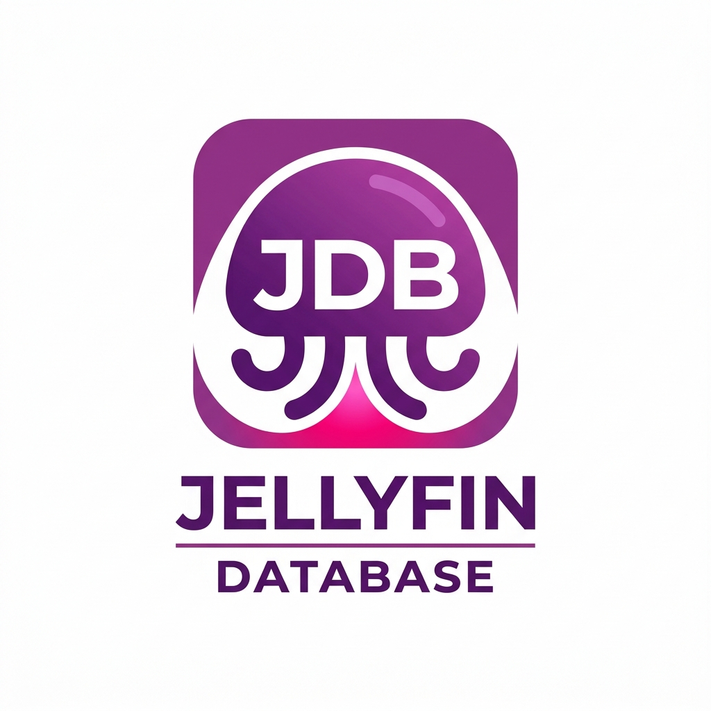

# JDB — MetaHub

**Jellyfin Meta DB** — a self-hosted media metadata aggregator (.NET / C#).

[](https://github.com/Kuschel-code/JDB/actions/workflows/ci.yml)
[](https://github.com/Kuschel-code/JDB/releases/latest)
[](https://dotnet.microsoft.com/)
[](https://jellyfin.org/)

MetaHub builds a single canonical, unified view per media item by combining several
official providers, cross-linking them by ID and caching everything locally — so
Jellyfin (and other clients) get consistent, rich metadata and artwork without hammering
every external API on each scan.

Like [Shoko](https://shokoanime.com/), MetaHub **identifies local files exactly**
(file hash / acoustic fingerprint / identifier) instead of guessing from filenames, and
only then aggregates metadata.

> Scope: **metadata only**. MetaHub does not index or provide unlicensed
> streaming/download sources. It identifies files you already own and enriches them.

**Media types:** Music · Movies · Series · Anime · Books

## Two ways to run

| Mode | What runs | Database | Best for |
|------|-----------|----------|----------|
| **Embedded plugin** (default) | Everything inside Jellyfin | local **SQLite** | Most users — no Docker, no server |
| **Standalone server** | Separate ASP.NET API + workers | **PostgreSQL** or SQLite | Non-Jellyfin clients, multi-app setups |

---

## Compatibility

| Jellyfin server | MetaHub plugin | .NET |
|---|---|---|
| **12.0, 12.1+** | **0.2.x** | 10 |
| 10.11.x | 0.1.9.9 (last 10.11 build) | 9 |

The repository below serves both: Jellyfin only offers the build whose `targetAbi` fits your
server, so a 10.11 server keeps seeing 0.1.9.9 and a 12.x server gets 0.2.x. Upgrading a
server from 10.11 to 12? Update the plugin from the catalog after the upgrade and restart —
the embedded database is kept.

## Get started — Jellyfin plugin (embedded, no Docker)

The recommended setup. The plugin runs the **whole engine inside Jellyfin** — a local
SQLite database in the plugin data folder, in-process identification/enrichment, and
ingest/enrichment exposed as Jellyfin **Scheduled Tasks**. Datasets come from GitHub.
**No Docker, no separate server, no database to install.**

1. **Add the repository** (Jellyfin → Dashboard → Plugins → Repositories → **+**):

   ```
   https://raw.githubusercontent.com/Kuschel-code/JDB/main/manifest.json
   ```

2. **Install** from Catalog → Metadata → **MetaHub**, then restart Jellyfin.
3. **Configure** under Plugins → MetaHub (**Mode / Library / Engine / Sources / About**) —
   keep *embedded* on. Optional: add a TMDB key (movies/series), a fanart.tv key
   (extra artwork), an Annict token, and AniDB credentials (exact file identification
   plus rich anime metadata). Every source can be toggled individually.
4. **Run the tasks** (Dashboard → Scheduled Tasks): **MetaHub: Update anime mappings**
   once, then **MetaHub: Enrich metadata**.

That's it — Jellyfin now pulls metadata and artwork from your local MetaHub.

The embedded database is a **rebuildable cache**: on plugin updates that change the
schema it is wiped and rebuilt automatically from the datasets and provider caches —
no manual migration steps.

## Get started — standalone server (optional)

Only needed if you want a shared MetaHub API for non-Jellyfin clients. In this mode the
Jellyfin plugin becomes a thin client (turn *embedded* off and point it at the API URL).

**Download** a self-contained build (no .NET install needed) for your platform from the
[latest release](https://github.com/Kuschel-code/JDB/releases/latest), or run from source:

### Docker (PostgreSQL + API)

```bash
export METAHUB_API_KEY="choose-a-long-random-string"
docker compose up --build
# API on http://127.0.0.1:8080  (Swagger UI at /swagger)
```

Both published ports bind to `127.0.0.1` by default — put a reverse proxy (with TLS)
in front if you need remote access.

### From source

Needs the **.NET 10 SDK**.

```bash
dotnet run --project src/MetaHub.Api    # needs a PostgreSQL (or: docker compose up db)
```

The connection string is read from `ConnectionStrings:MetaHub` (or `METAHUB_CONNECTION`).
Migrations are applied on startup unless `MetaHub:AutoMigrate` is `false`. Trigger an
ingest with:

```bash
curl -X POST -H "X-Api-Key: $METAHUB_API_KEY" http://127.0.0.1:8080/api/admin/ingest/anime
```

### API authentication

When `MetaHub:ApiKey` (env: `MetaHub__ApiKey`) is set, **every `/api` route requires the
`X-Api-Key` header** (constant-time comparison); `/health` stays open for probes. Without
a key the API is open and a loud warning is logged at startup — fine on a trusted LAN,
not fine anywhere else.

---

## Architecture

```
Local files ─► [0] Identification ─► file ↔ work link (ED2K/AniDB, AcoustID, ISBN, filename/TMDB)
Mappings    ─► [1] Ingest         ─► master data + cross-IDs   (SQLite embedded / PostgreSQL server)
External    ─► [2] Enrichment     ─► normalized fields + artwork (rate-limited, cached, Polly)
APIs        ─► [3] Delivery       ─► Jellyfin plugin (in-process) · Web API · NFO export
```

**Enrichment sources:** AniList · Jikan (MAL) · Kitsu · Shikimori · Annict ·
**AniDB HTTP** (titles, episodes incl. specials, characters/seiyuu, artwork) ·
TMDB · fanart.tv · MusicBrainz · Open Library · Google Books.
Each provider is cached with a TTL, rate-limited, and individually switchable; results
are merged per-field by source priority.

**AniDB** is used twice, with separate clients and separate rate limits: the **UDP API**
identifies local files exactly by ED2K hash (Shoko-style), the **HTTP API** supplies the
anime metadata. Both are ban-aware (automatic backoff) and never fetch uncached in a loop.

## Tech stack

| Layer            | Choice                                          |
|------------------|-------------------------------------------------|
| Runtime          | .NET 10 (matches Jellyfin 12)                   |
| Web API          | ASP.NET Core Minimal APIs                       |
| ORM / DB         | EF Core — SQLite (embedded) or PostgreSQL (server) |
| HTTP resilience  | `IHttpClientFactory` + Polly                    |
| Logging          | Serilog (server) / `Microsoft.Extensions.Logging` |
| Jellyfin         | `IRemoteMetadataProvider` / `IRemoteImageProvider` + Scheduled Tasks |
| Container        | Docker / docker-compose (server mode only)      |

## Project layout

```
src/
  MetaHub.Domain          Entities + enums (the unified data model)
  MetaHub.Infrastructure  EF Core DbContext + migrations (SQLite or PostgreSQL)
  MetaHub.Ingest          Anime ingest (manami + Fribb) with Polly-backed HTTP
  MetaHub.Identification  Shoko core: ED2K/MD4/CRC32 hashing, AniDB UDP + HTTP clients, name parser
  MetaHub.Enrichment      Providers (see list above), per-field merger, episode sync (Jikan + AniDB)
  MetaHub.Export          NFO export (Jellyfin/Kodi-compatible *.nfo)
  MetaHub.Api             ASP.NET Core Minimal API (standalone server mode, X-Api-Key gate)
  MetaHub.Jellyfin        Jellyfin plugin: embedded engine, providers, scheduled tasks, settings UI
tests/
  MetaHub.Tests           Unit + SQLite integration tests
docs/
  CONFIGURATION.md        Full settings reference (both modes)
  CONCEPT.md              Design/architecture notes
  DATA_SOURCES.md         Curated provider/dataset catalogue
```

## Configuration

In **embedded** mode all settings live in the plugin UI (Mode / Library / Engine). In
**server** mode the engine is configured in `MetaHub.Api/appsettings.json`. Both are
documented in **[docs/CONFIGURATION.md](docs/CONFIGURATION.md)** (defaults, env-var
overrides, secrets handling).

Highlights:

- **Enrichment write mode** — `FillMissingOnly` (default, never touches existing metadata)
  or `Overwrite`. Genres and images are always additive.
- **Per-source toggles** — every provider can be switched off individually.
- **AniDB** — disabled by default; needs a registered client (UDP for file
  identification, HTTP for anime metadata) and an account. Conservative rate limits and
  ban backoff are built in.
- **Scheduling** — embedded mode uses Jellyfin Scheduled Tasks; server mode has a built-in
  background scheduler (`Scheduler` section).
- **Your own databases** — add self-hosted sources (a folder of files, or your own endpoint);
  see below.

## Your own metadata databases

Besides the built-in sources you can add databases you host yourself. Configure them in
**Metadata sources → Your own databases** (embedded mode) or under `Enrichment:CustomSources`
(server mode), one per line:

```
Name | Location | Priority | ApiKey
```

Only the location is required and it must be absolute. A location starting with `http://` or
`https://` is queried as an endpoint, anything else is read as a folder:

```
My NAS   | /mnt/nas/metadata
Home API | https://meta.lan/metahub | 3 | s3cret
/srv/anime-db
```

Custom sources are matched by **title** (canonical, original, or any known translation),
ignoring case and punctuation — no provider IDs required. Changes apply after a Jellyfin restart.

### Who wins a conflict

**When sources disagree** (`Enrichment:CustomSourceMode`) decides how your data ranks against
the built-in providers:

| Mode | Behavior |
|------|----------|
| `Prefer` *(default)* | Your database wins every field it fills; the built-in sources supply the rest. |
| `Fallback` | The built-in sources lead; yours only fills what they left empty. |
| `Auto` | Per entry: one carrying real content (an overview, artwork or cast) wins, while a bare stub — say just a title and a year — steps behind the built-in sources instead of overriding better data with scraps. |

Merging is per field either way, so a source never blanks a field it has nothing for. The
optional `Priority` column overrides the mode for one source (lower wins; the built-ins sit at
10–30).

### Folder layout

One subfolder per title (or a file named after it), holding `metahub.json` or an `.nfo`:

```
/mnt/nas/metadata/
├── The Disastrous Life of Saiki K/
│   ├── metahub.json
│   ├── poster.jpg
│   └── fanart.jpg
└── My Movie.json
```

Recognized file names are `metahub.json`, `metadata.json`, `info.json`, `movie.nfo`,
`tvshow.nfo`, `album.nfo`, `book.nfo` — otherwise the first `.json`/`.nfo` in the folder is
used. Kodi/Jellyfin **NFO** sidecars are understood as-is, so an existing library works
without conversion. Artwork referenced relatively is read from next to the metadata file.

### JSON document

Every field is optional; supply only what you have.

```json
{
  "title": "My Show",
  "originalTitle": "Meine Serie",
  "year": 2021,
  "overview": "An overview.",
  "overviews": { "de": "Eine Beschreibung." },
  "titles": { "en": "My Show", "ja": "マイショー" },
  "status": "Finished",
  "genres": ["Action", "Drama"],
  "episodeCount": 12,
  "network": "My Studio",
  "poster": "poster.jpg",
  "images": [
    { "type": "backdrop", "url": "fanart.jpg", "lang": "de", "width": 1920, "height": 1080 }
  ],
  "people": [
    { "name": "Jane Doe", "role": "Actor", "character": "Hero", "order": 0 }
  ]
}
```

`type` is one of `poster`, `backdrop`/`fanart`, `banner`, `logo`, `thumb`, `cover`; `role` is a
credit role such as `Actor`, `Director`, `Writer`, `Composer`, `Author`, `VoiceActor`. Music and
book fields (`label`, `albumType`, `trackCount`, `isbn13`, `pageCount`, `publisher`) are
supported too.

### HTTP endpoint

Your endpoint receives the title and everything MetaHub already knows and answers with the same
JSON document:

```
GET https://meta.lan/metahub?title=My%20Show&type=Series&year=2021&anidb=1234
X-Api-Key: s3cret
```

Answer `404` when you do not have the title. A bare array or a `{"data": …}` / `{"work": …}`
envelope is accepted as well, so a small search API needs no extra shaping.

## API endpoints (server mode)

All `/api` routes require the `X-Api-Key` header when `MetaHub:ApiKey` is configured.

| Method | Route                                  | Purpose                                   |
|--------|----------------------------------------|-------------------------------------------|
| GET    | `/health`                              | Liveness (always open)                    |
| GET    | `/api/work/{id}?lang=de`               | Canonical record (localized overview)     |
| GET    | `/api/work/{id}/images?type=poster`    | Artwork for a work                        |
| GET    | `/api/series/{id}/episodes`            | Episodes of a series/anime                |
| GET    | `/api/lookup?source=tmdb&id=12345`     | Resolve by external id                    |
| GET    | `/api/search?type=anime&q=...`         | Title search                              |
| GET    | `/api/config`                          | Read-only engine config (secrets as bools) |
| GET    | `/api/work/{id}/nfo`                    | NFO XML for the work (Jellyfin/Kodi)      |
| POST   | `/api/identify`                        | Resolve an already-identified file by hash/path |
| POST   | `/api/files/identify`                  | ED2K-hash a local file + AniDB lookup     |
| POST   | `/api/admin/ingest/anime`              | Trigger the anime ingest                  |
| POST   | `/api/admin/enrich/work/{id}`          | Enrich one work                           |
| POST   | `/api/admin/enrich/anime`              | Batch-enrich anime works (paced)          |
| POST   | `/api/admin/export/nfo/{id}?dir=...`   | Write an NFO file to a directory          |
| GET    | `/api/admin/stats`                     | Counts (works by type, files, images, ...) |

## Roadmap

- [x] **M1** Skeleton: solution, EF model, migrations, `Work`/`ExternalId`/`MediaFile`
- [x] **M2** Anime ingest: manami + Fribb → master data + cross-IDs
- [x] **M3** Anime identification: ED2K hashing + AniDB file lookup (Shoko core)
- [x] **M4** Enrichment v1: AniList + Jikan end-to-end (Polly + cache)
- [x] **M5** API + NFO export
- [x] **M6** More media types: movies/series (TMDB), music (MusicBrainz), books (Open Library + Google Books)
- [x] **M7** Jellyfin metadata/image provider plugin
- [x] **M8** Conflict resolution (priority + write modes), image scoring, i18n (`?lang=`), Serilog + stats
- [x] **Embedded mode** — full engine inside Jellyfin (SQLite), no Docker/server
- [x] **AniDB HTTP metadata (P1)** — titles, episodes (incl. specials/credits), characters/seiyuu, artwork
- [ ] **anime-lists ingest (P2)** — richer AniDB ↔ TVDB/TMDB cross-mapping
- [ ] **Season/episode remapping (P3)** — map AniDB absolute numbering onto TVDB-style S/E

## Development

```bash
dotnet build      # build all projects
dotnet test       # unit + SQLite integration tests
```

**Cutting a release:** push a tag (`git tag v0.2.0.0 && git push origin v0.2.0.0`) **or** run it
from the UI — **Actions → Release → Run workflow**, enter the version. The workflow creates the
tag + GitHub Release, builds the runtime zips and the Jellyfin plugin zip, and updates
[`manifest.json`](manifest.json) (with the plugin zip's MD5) so the plugin repository link
serves the new version automatically. `manifest.json` is owned by that workflow — don't
edit it by hand.

## Legal

For personal use. Respect each provider's ToS and rate limits (User-Agent + contact
where required, e.g. MusicBrainz/AniDB). Cache aggressively; do not re-host aggregated
data or images publicly. See [docs/CONCEPT.md](docs/CONCEPT.md) for details.
